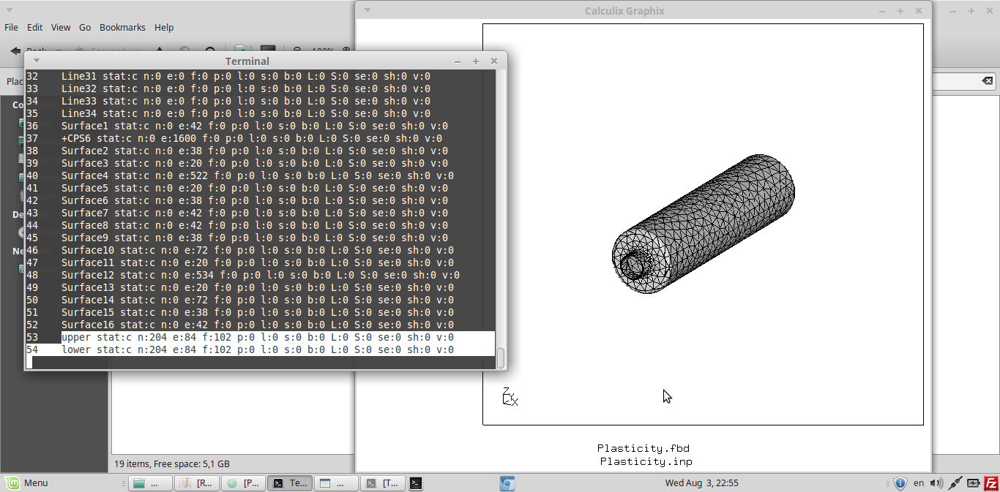
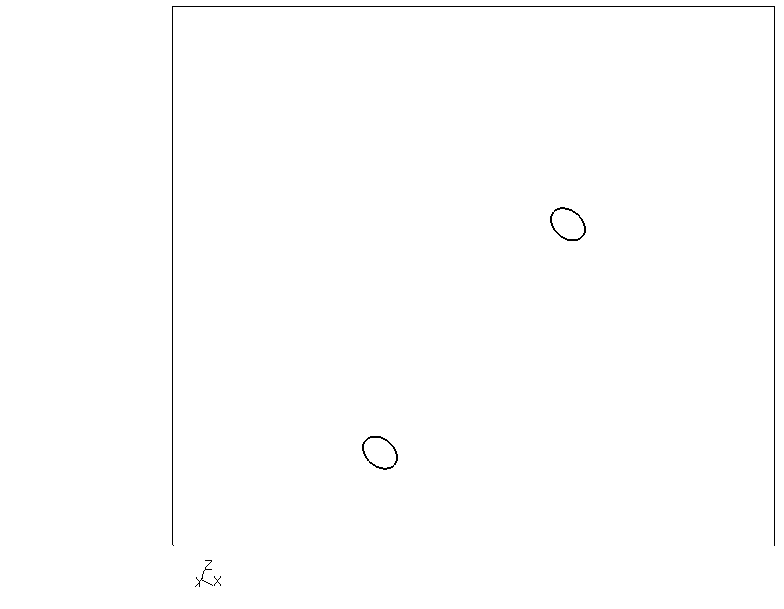
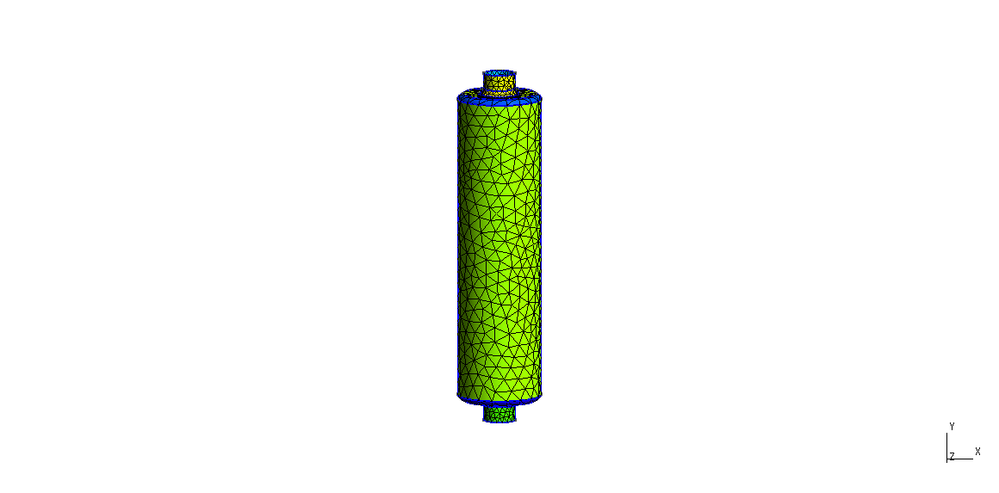
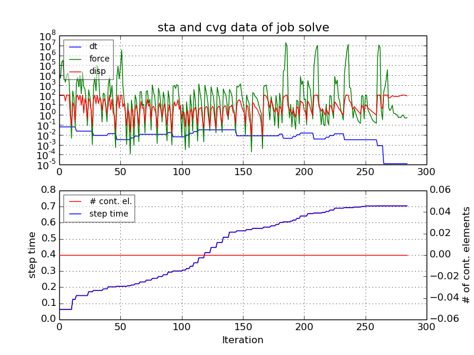
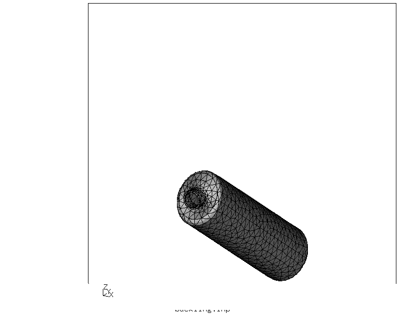
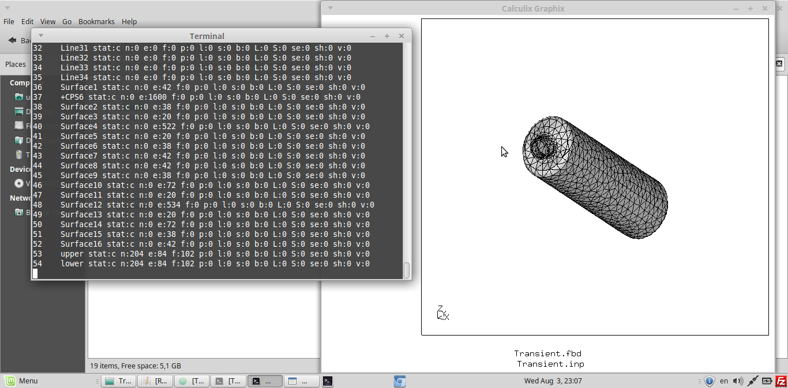
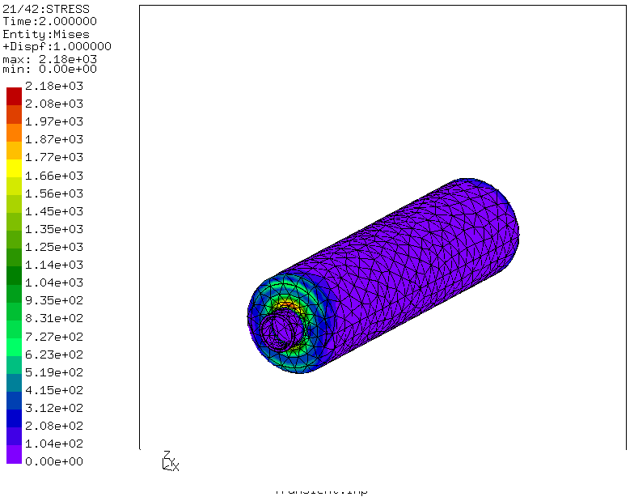
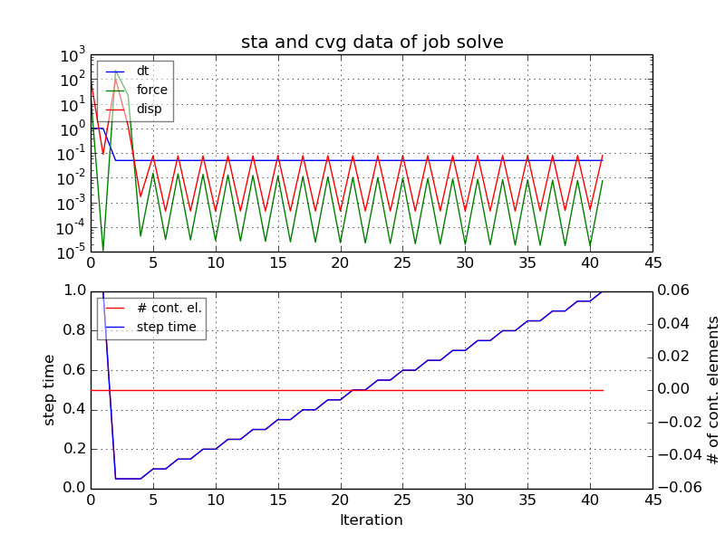

# Buckling and transient analysis of Boiler Surface

First I have shown workflow of CalculiX with Gmsh and then i have done the analysis

* Set definition in Gmsh

We can define sets as physical surfaces/lines/volume/points in Gmsh.

The following photo shows, how can this physical sets be defined in Gmsh.


* Sets in CGX

For example, In this Analysis, there are two sets defined in Gmsh, that are lower and Upper. You can check this Sets in .geo file.

Both this sets can be checked in CGX with command 
```
> ,prnt se'.
```
In the photo below, we can see the sets in CGX, which are defined in gmsh (.geo file)


# Analysis

The things which are checked,
* Large displacements
* with Plasticity
* Buckling with imperfection (a small internal pressure of -1N)

| File     | Contents       |
| :------- | :------------- |
| [Plasticity.STEP](Plasticity.STEP) | STEP geometry Imported from 3D Modeling Software |
| [Plasticity.geo](Plasticity.geo) | Gmsh control file for meshing and model display |
| [Plasticity.fbd](Plasticity.fbd) | CGX control file for preprocessing, solving and postprocessing |
| [solve.inp](solve.inp) | CCX input file |


Boundry Conditions
* The Incoming and outgoing holes Surfaces are fixed.

Photo


Meshing
* Meshing is done in Gmsh and Transfinite Function is used to do a finer meshing.

Photo(.geo file)
```
> gmsh Plasticity.geo
```



Displacement photo
```
> cgx -b Plasticity.fbd
```


Solving
```
> ccx solve
> monitor.py solve
```

# Buckling and transient analysis of Boiler Surface

The things which are checked,

* Large displacements
* without Plasticity
* Buckling with imperfection (a small internal pressure of -1N)

A) Procedure to do the analysis

* Import the STEP File in Gmsh.
* Do the meshing using Transfinite function.
* Create Physical surfaces, which you can use as sets in CGX.
* Create the .inp File.
* Create .fbd File using this .geo File and .inp file for Analysis
* Create Solve.inp file
* Run the analysis.

| File     | Contents       |
| :------- | :------------- |
| [Transient.STEP](Transient.STEP)	|  STEP geometry imported from 3D modeling Software |
| [Transient.geo](Transient.geo)	|  Gmsh  control file for meshing and model display |
| [Transient.fbd](Transient.fbd)	|  CGX   control file for preprocessing, solving and postprocessing |
| [solve.inp](solve.inp)	  |    CCX input file |

* Boundry Conditions

-The Incoming and outgoing holes Surfaces are fixed.

-Photo


* Meshing
-Meshing is done in Gmsh and Transfinite Funktion is used to do a finer meshing.

-Photo(.geo file)
```
> gmsh Transcient.geo
```




* Set Defination

-For example, In this Analysis, there are two sets defined in Gmsh, that are lower and Upper. You can check this Sets(Physical surfaces) in .geo file.

Both this sets can be checked in CGX with command 
```
>,prnt se'.
```
-In the photo below, we can see the sets which are defined in gmsh, in CGX



Displacement photo
```
> cgx -b Plasticity.fbd
```



Solving
```
> ccx solve
> monitor.py solve
```



