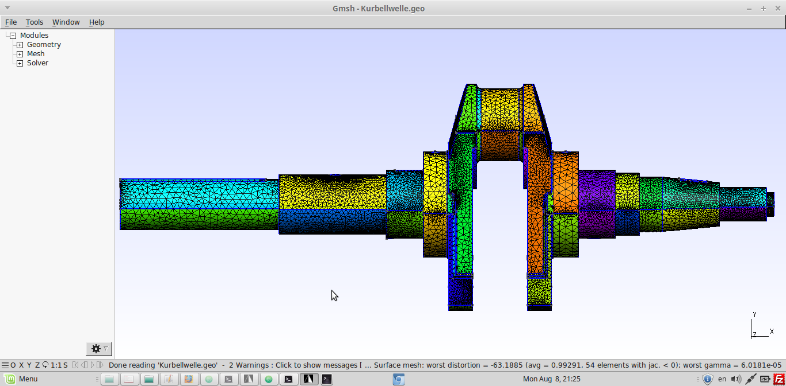
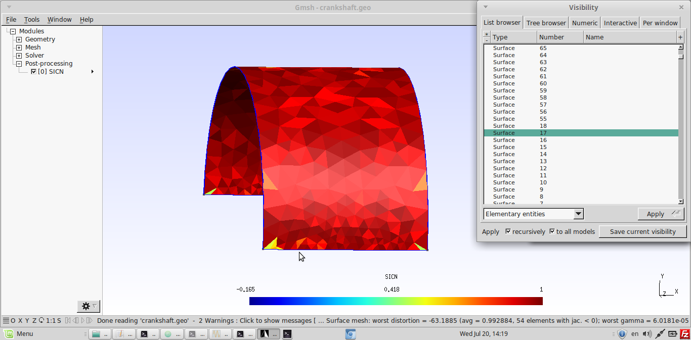

# Difficulty in meshing a complex geometry(non-jacobian error)

* Its difficult to import a complex geometry and mesh it in gmsh.

* In this Example, i have tried to do finer meshing of the component, so that when it is used in CalculiX, then there will be no Non-Jacobian errors.

* Because when we have a complex geometry and want to do a static transient or dynamic transient analysis, then this normally meshed geometry from gmsh shows the non-jacobian errors in CGX.

* One way to minimize this error is to use transfinite function to do finer meshing and to overcome the surface distortion.

* I have tried to do this,

-First, when normal meshing was done it showed around 220 surface distortion errors, because of which the non-jacobian error showed    in CGX

-Then, i used transfinite function to do finer meshing and overcome surface meshing, but still it showed 20 surface distortion.

* In the following images, i have showed, how the geometry looks after transfinite function is used for every surface

Image of meshing
```
> gmsh Kurbelwelle.geo
```





Using Transfinite function to do the meshing and then checking the surfaces, where negative elements are there, so that they can be meshed with more finer elements 
