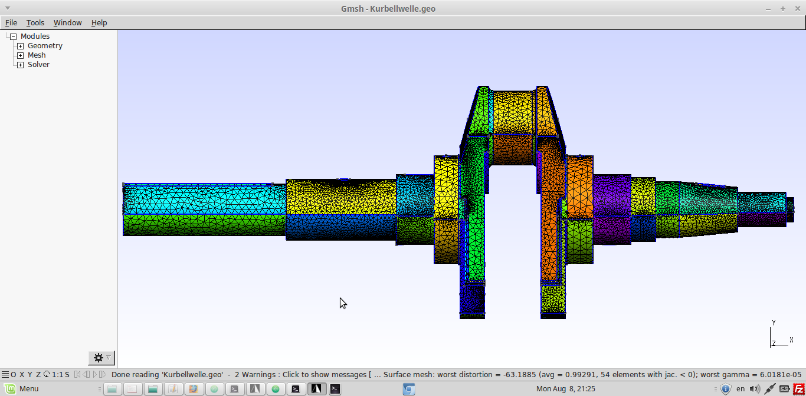
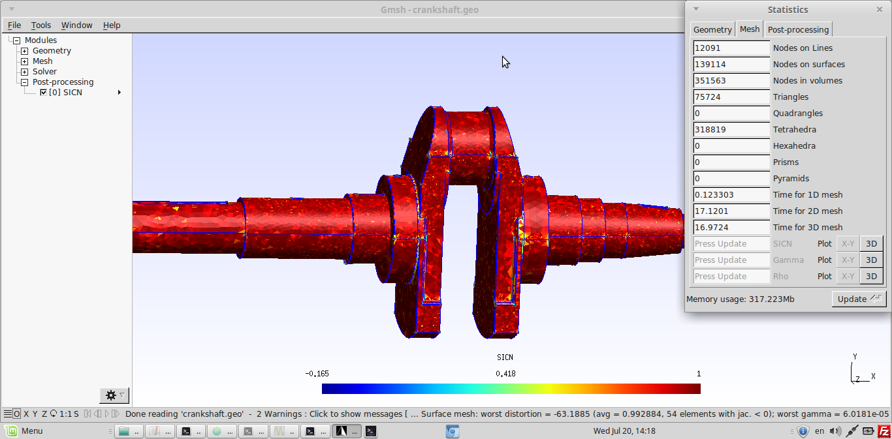
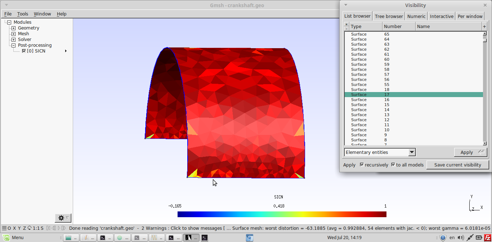
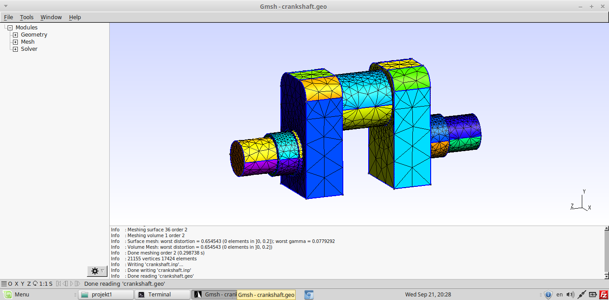

# Static Analysis on Crankshaft

The Basic intention was to do meshing of a complicated geometry in GMSH and see if it can be then used for analysis in CalculiX.

This analysis was done to check the stress on the crankshaft.

| File     | Contents       |
| :------- | :------------- |
| [Crankshaft.stp](Crankshaft.stp) | STEP geometry Imported from 3D Modeling Software |
| [Crankshaft.geo](Crankshaft.geo) | Gmsh control file for meshing and model display |
| [Fine-Meshed Crankshaft.geo](Fine-Meshed Crankshaft.geo) | Gmsh control file for meshing and model display |
| [Crankshaft.fbd](Crankshaft.fbd) | CGX control file for preprocessing, solving and postprocessing |
| [solve.inp](solve.inp) | CCX input file |


* Meshing

Meshing was done in Gmsh (Without using any Functions). Two physical surfaces(Pressure and support) were also defined in Gmsh so that they can be used as sets in CGX 

Photo(.geo file)
```
> gmsh Crankshaft.geo
```


Physical Surface definition


* Boundary conditions

The surface which is in contact with the bearing or the pulley with the belt, are fixed and Pressure is applied, where the Crankrod is connected with the crankshaft i.e Rod journel portion.

Photo


Pressure Definition
Pressure of 1000 N is applied and results are checked.

The pressure is given 1000 N because when the piston retracts it excerts pressure on the Rod journel portion of the crankshaft, at that time the pressure is in betwwen 800N to 1800N, since i am not doing a exact analysis, therefore i have given a pressure of 1000N. 
The results are then checked.

* Stress Photo
```
> cgx -b Crankshaft.fbd
```
* Result von Mises Stress


The Sets which are defined in Gmsh can be seen in CGX,

For example, In this Analysis, there are two sets defined in Gmsh, that are Support and Pressure. You can check this Sets in physical surface definition image above.

Both this sets can be checked in CGX with command 
```
> ,prnt se'.
```
In the photo below, we can see the sets which are defined in gmsh, in CGX


# Difficulty in meshing a complex geometry(non-jacobian error)

* Its difficult to import a complex geometry and mesh it in gmsh.

* In this Example, i have tried to do finer meshing of the component, so that when it is used in CalculiX, then there will be no Non-Jacobian errors.

* Because when we have a complex geometry and want to do a static transient or dynamic transient analysis, then this normally meshed geometry from gmsh shows the non-jacobian errors in CGX.

* One way to minimize this error is to use transfinite function to do finer meshing and to overcome the surface distortion.

* I have tried to do this,

-First, when normal meshing was done it showed around 220 surface distortion errors, because of which the non-jacobian error showed    in CGX

-Then, i used transfinite function to do finer meshing and overcome surface meshing, but still it showed 20 surface distortion.

* In the following images, i have showed, how the geometry looks after transfinite function is used for every surface


Image of meshing
```
> gmsh Fine-Meshed Crankshaft.geo
```






Using Transfinite function to do the meshing and then checking the surfaces, where negative elements are there, so that they can be meshed with more finer elements 

# Comparison between simple Crankshaft and complex Crankshaft.

* After this, I have taken a more simple geometry of crankshaft with less edges and small surfaceand tried to do its meshing with transfinite function. 

* The result of this was that all the surface distortion we overcomed. It didnt showed any errors.

* Which proved that simole geometry are easy to be meshed then the complex ones.

Image of meshing
```
> gmsh simple-Crankshaft.geo
```



