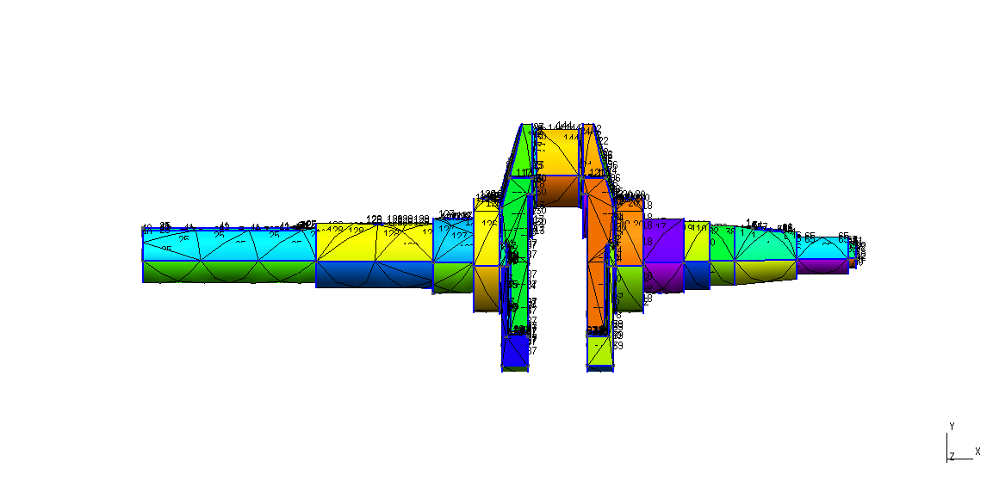
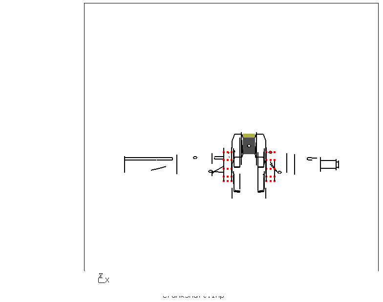

# Static Analysis on Crankshaft

The Basic intention was to do meshing of a complicated geometry in GMSH and see if it can be then used for analysis in CalculiX.

This analysis was done to check the stress on the crankshaft.

| File     | Contents       |
| :------- | :------------- |
| [Cranshaft.step](Crankshaft.step) | STEP geometry Imported from 3D Modeling Software |
| [Crankshaft.geo](Crankshaft.geo) | Gmsh control file for meshing and model display |
| [Crankshaft.fbd](Crankshaft.fbd) | CGX control file for preprocessing, solving and postprocessing |
| [solve.inp](solve.inp) | CCX input file |


* Meshing

Meshing was done in Gmsh (Without using any Functions). Two physical surfaces(Pressure and support) were also defined in Gmsh so that they can be used as sets in CGX 

Photo(.geo file)
```
> gmsh Crankshaft.geo
```


Physical Surface definition


* Boundary conditions

The surface which is in contact with the bearing or the pulley with the belt, are fixed and Pressure is aplied, where the Crank rod is connected with the crank shaft i.e Rod journel portion.

Photo



Pressure Definition
Pressure of 1000 N is applied and results are checked.

The pressure is given 1000 N because when the piston retracts it excerts pressure on the Rod journel portion of the crankshaft, at that time the pressure is in betwwen 800N to 1800N, since i am not doing a exact analysis, therefore i have given a pressure of 1000N. 
The results are then checked.

* Stress Photo
```
> cgx -b Crankshaft.fbd
```
* Result von Mises Stress


The Sets which are defined in Gmsh can be seen in CGX,

For example, In this Analysis, there are two sets defined in Gmsh, that are Support and Pressure. You can check this Sets in physical surface definition image above.

Both this sets can be checked in CGX with command 
```
> ,prnt se'.
```
In the photo below, we can see the sets which are defined in gmsh, in CGX


