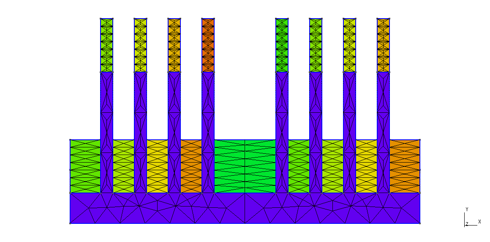
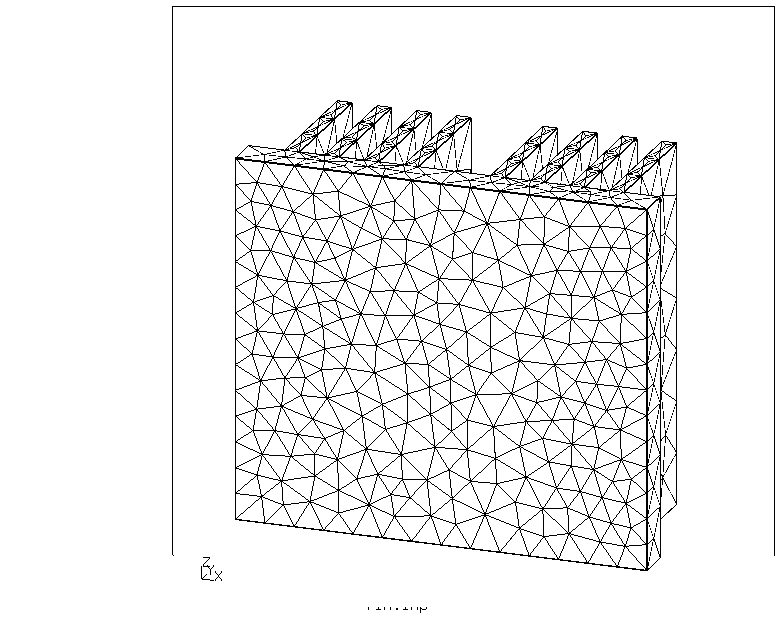
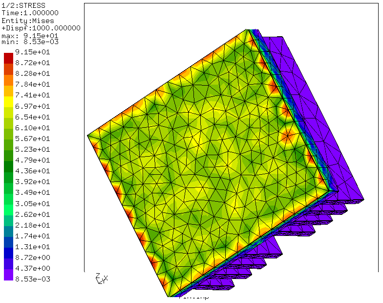

Thermal analysis on Heat sink(FIN)

A heat sink which is used in many application to reduce the heat of the system.
So i have taken a Fin which is small in size, which is used, for example in laptops over the processor to reduce the heat in processors.

Its a unconstrained body.
* Import the STEP File in Gmsh.
* Do the meshing using Transfinite function.
* Create Physical surfaces, which you can use as sets in CGX.
* Create the .inp File.
* Create .fbd File using this .geo File and .inp file for Analysis
* Create Solve.inp file
* Run the analysis.

| File     | Contents       |
| :------- | :------------- |
| [Fin.step] (Fin.step) |  STEP geometry exported from Onshape |
| [Fin.geo] (Fin.geo) |	Gmsh  control file for meshing and model display |
| [Fin.fbd] (Fin.fbd)	| CGX control file for preprocessing, solving and postprocessing |
| [solve.inp] (solve.inp) |	  CCX input file |

Only temperature is given at the bottom surface of 25 degree.

Mesh 
* Meshing is done in Gmsh and Transfinite Funktion is used to do a finer meshing.

Photo(.geo file)

Stress Photo

Set defination 
* Only one set is defined, which is Support.

