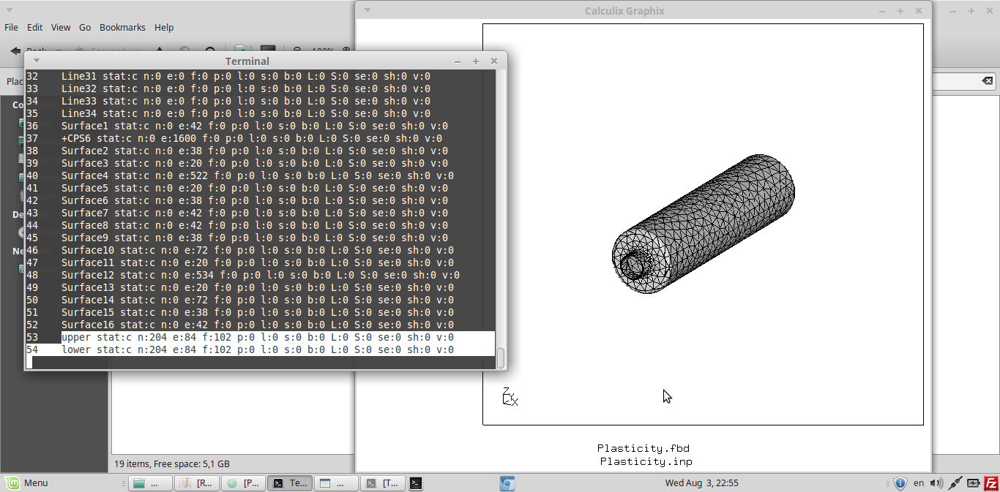
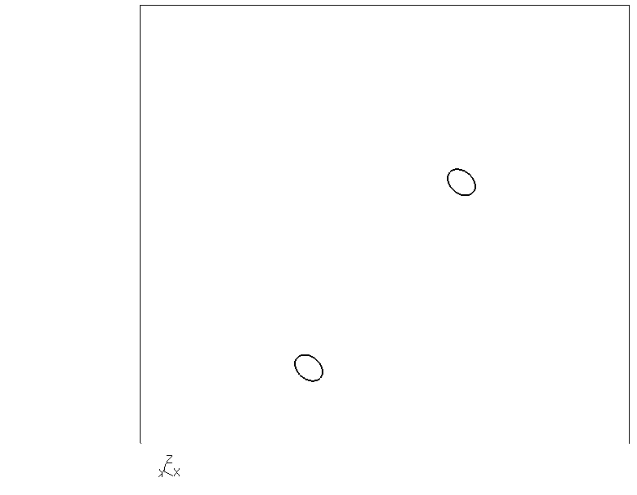
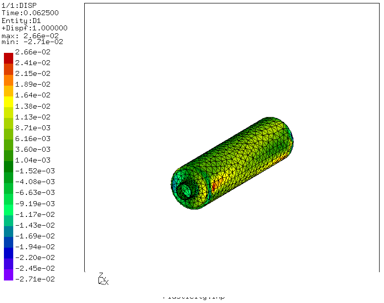

# Buckling and transient analysis of Boiler Surface

First I have shown workflow of CalculiX with Gmsh and then i have done the analysis

* Set definition in Gmsh

We can define sets as physical surfaces/lines/volume/points in Gmsh.

The following photo shows, how can this physical sets be defined in Gmsh.

* Sets in CGX
* For example, In this Analysis, there are two sets defined in Gmsh, that are lower and Upper. You can check this Sets in .geo file.
* Both this sets can be checked in CGX with command ,prnt se'.

In the photo below, we can see the sets in CGX, which are defined in gmsh (.geo file)

The things which are checked,
* Large displacements
* with Plasticity
* Buckling with imperfection (a small internal pressure of -1N)

Boundry Conditions
* The Incoming and outgoing holes Surfaces are fixed.

Photo

Meshing
* Meshing is done in Gmsh and Transfinite Funktion is used to do a finer meshing.

Photo(.geo file)
/home/user/Calculix files/calculiX-Beispielen/Plasticity /Refs/geo.png

Displacement photo
/home/user/Calculix files/calculiX-Beispielen/Plasticity /Refs/se.png

