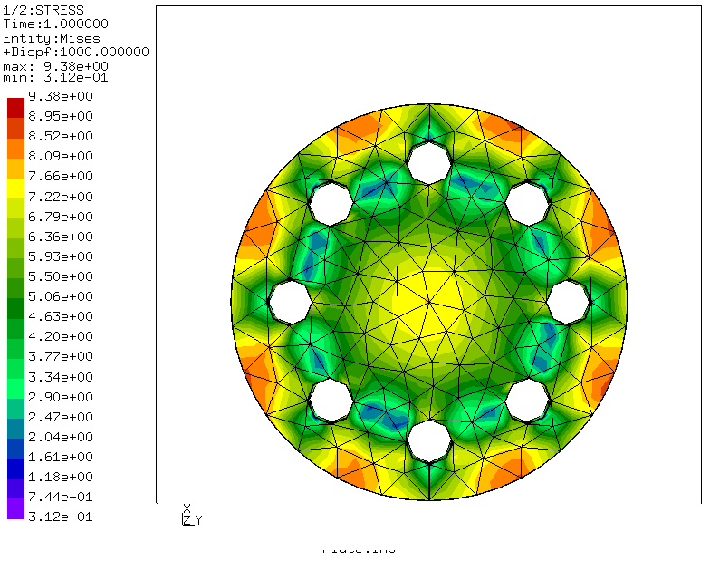

# Modal Analysis on a Plate with holes.

This analysis was also done to get used to the workflow of CalculiX and GMSH.

| File     | Contents       |
| :------- | :------------- |
| [Plate.step](Plate.step) | STEP geometry Imported from 3D Modeling Software |
| [Plate.geo](Plate.geo) | Gmsh control file for meshing and model display |
| [Plate.fbd](Plate.fbd) | CGX control file for preprocessing, solving and postprocessing |
| [solve.inp](solve.inp) | CCX input file |

-Boundry Conditions.

The Outer round Surface(Width) is Fixed and pressure of 1N is aplied on the top surface of the plate.
The photo of hcpy_1 shows the boundry condition.

-Set Defination Photo


-Meshing photo(.geo file)
```
> gmsh Plate.geo
```


-Von mises Stress Photo
```
> cgx -b Plate.fbd
```


* Set Defination

-The Sets which are defined in Gmsh can be seen in CGX

-For example, In this Analysis, there are two sets defined in Gmsh, that are Support and Pressure. You can check this Sets in .geo file.

 Both this sets can be checked in CGX with command 
 ```
 > ,prnt se'.
 ```

-In the photo below, we can see the sets which are defined in gmsh, in CGX


