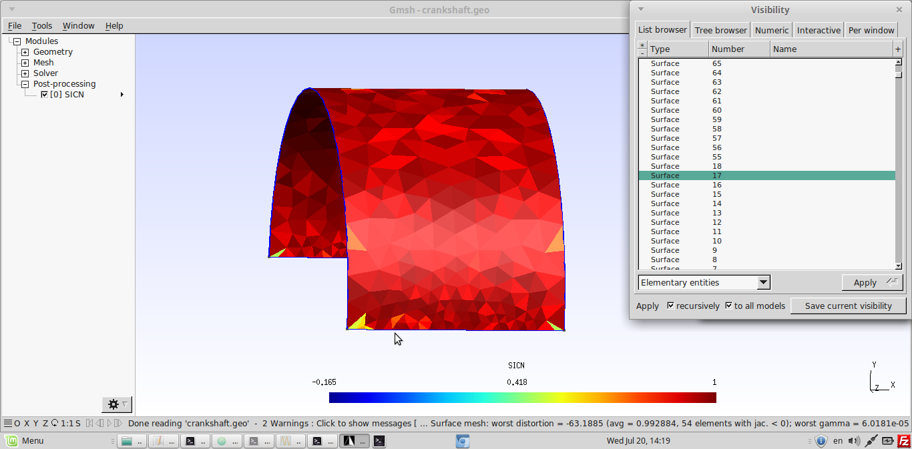
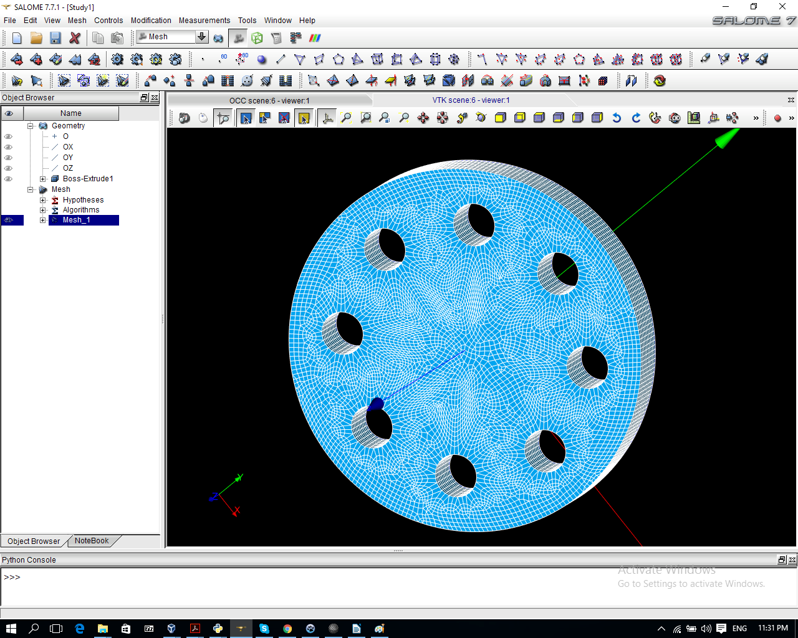

INHALTSVERZEICHNIS
* 1.CalculiX Einleitung:
* 2.Installation:

   2.1). Oracle Virtual Box und Virtual Maschine bei
         Sven kaßbohm
        
         2.1.1)Das Problem und die Losungen:
   
    2.2). Bconverged Version (CalculiX 2.10)
    
    2.3). General Electronics Version(Von Github
        Website)
        
* 3.Wie importieren wir CAD Geometrie in CalculiX
    
     3.1 GMSH

        3.1.1 Beispiel 1 (Plate)
        
        3.1.2 Das Problem:
        
        3.1.3 Beispiel 2 (Kurbelwelle)
        
     3.2 Salome
     
     3.3 Netgen
     
     3.4 Mecway
     
* 4.Videos:

____________________________________________________________________________________________________________________________________
# 1. EINLEITUNG:

CalculiX ist eine Open Source Software für Finite Element Analysis ( FEM). Es
wird von Guido Dhondt und Klaus Wittig, Mitarbeiter der Firma MTU Auero-
Engines, entwickelt, um dreidimensionale Strukturberechnungen
durchzuführen. Es nutzt dabei das Abaqus- Eingabeformat für den
Gleichungslösen.

# 2. INSTALLATION

a) Wie wird die aktuelle Version von CalculiX in Windows PC installiert?

* Die aktuelle Version von CalculiX ist 2.10. Diese Version funktioniert
nur im Linux. Es wird von der Website http://www.dhondt.de/
heruntergeladen. Auf der Website werden der Quellcode und „Linux-
Executables“ angeboten.'

* Für Windows kann die Version ,, CalculiX 2.8‘‘ von Bconverged Website
herunterladen werden.

*  Um die aktuelle Version in Windows zu installieren, gibt es drei
Möglichkeiten:

 1). Oracle Virtual Box und Virtual Maschine bei Sven kaßbohm.

 2). Bconverged Version (CalculiX 2.8)

 3). Von Github Website

** 2.1 ORACLE VIRTUAL BOX UND VIRTUAL MASCHINE BEI SVEN
KAßBOHM:

* Es gibt ein Programm ,,ORACLE Virtual Box (VB)‘‘, mit dem beide
Windows und Linux gleichzeitig benutzt werden können. Diese VB ist
auch eine freie Software, die wir direkt vom Internet herunterladen
können. Es wird von der Website
https://www.virtualbox.org/wiki/Downloads heruntergeladen.

* In diesem VB können wir verschiedene Virtual Maschine (VM)
installieren. Es gibt eine spezielle VM für CalculiX. Diese VM ist bei Sven
Kaßbohm zusammengestellt. Es wird unter der
Website ,,http://vbox.fiziko.de/‘‘ herunterladen. Diese VM ist ein Linux
Betriebe System, damit ist CalculiX 2.10 schon installiert. Nachdem wir
diese VM installiert haben, können wir uns direkt mit CalculiX
beschäftigen.

** 2.1.1 DAS PROBLEM UND DIE LÖSUNGEN:

*Während der Installation können folgende Probleme entstehen:
a) Fehlermeldung ,,one or more Virtual Maschine is already installed‘‘

* Wenn eine solche Fehlermeldung kommt, muss die USB Einstellung
des Vbs verändert werden. Dies wird wie folgt getan:
```
> VB→Setting→ USB → verändern von Usb1 zu Usb2 oder Usb3.
```
*  Es ist wichtig, die ,, EXTENSIONAL Pack“ vom Virtual Box
herunterzuladen. Damit kann USB 2 und USB 3 Option funktionieren.

b) Die VM ist schon installiert, aber es funktioniert nicht. Nur ein schwarzer
Bildschirm ist zu sehen.

* Wenn ein solcher Fehler passiert, müssen die Einstellungen im BIOS
verändert werden.Wenn der PC gestartet wird, müssen F2 oder Esc (ist
anders für andere PC) gedruckt werden, um in BIOS-Einstellungen zu
gehen. Dort gibt es eine ,,Virtualization Technologie‘‘ Option. Diese
Option muss aktiviert werden.
```
> 'BIOS→ ADVANCE →INTEL VIRTUALIZATION TECHNOLOGY → ENABLE.'
```
* https://www.youtube.com/watch?v=-Wa7TGjmn5M- In dieser Video ist
es gezeigt, wie Virtualization Technology aktiviert werden kann.

** 2.2 CALCULIX 2.10 von BCONVERGED.

*  Es wird CalculiX 2.10 Version von der Website
http://www.bconverged.com/products.php heruntergeladen.

*  Diese Version ist die aktuelle Version für Windows OS.

** 2.3 CALCULIX 2.10 von Github (geänderte Version)

* Ich habe versucht, diese Version zu installieren,
https://github.com/GeneralElectric/CalculiX das funktioniert bei mir.

# 3) Wie wird die CAD Geometrie in CalculiX importiert?

Es gibt einige Möglichkeiten, damit können wir CAD Geometrie in CalculiX
benutzen.

1) Gmsh:

2) Salome:

3) Netgen:

4) Mecway:
______________________________________________________________________________________________________________________________________

** 3.1) GMSH

● Gmsh ist ein freies 3D Finite-Elemente-Gittergenerator mit einem
eingebauten in CAD-Engine und Post-Prozessor.

● Wir können in irgendwelche CAD Software ein Geometrie einbauen
und in STEP Format einspeichern, danach können wir diese File in
Gmsh öffnen und dann machen wir einfach Netz.

● Nachdem wir es Netz gemacht habe, können wir es als Input File für
CalculiX (.inp) einspeichern . Wenn wir es als Input File eingespeichert
haben, können wir es weiter in CalculiX benutzen.

** 3.1.1) Beispiel 1 (Plate)

● Beispielweise zeige ich eine Geometrie, die ich in Solidworks
eingebaut habe und weiter als .Step File gespeichert habe und in Gmsh
vernetzt habe.

● Wir können unsere Vorgang in drei Script verteilen.

a) plate.geo

b) run.fbd

c) solve.inp

Ein Geometrie ist in Solidworks eingebaut und als STEP File eingespeichert.

a) plate.geo:

In diese Script machen wir Netz und plate.inp File.

| Commands      | Discription       |
| :------- | :------------- |
| Merge "part3.STEP"; | Step file von CAD. |
| Mesh.ElementOrder=2; Mesh.Optimize=1;  | // Netz kontrolle |
| //Mesh.SurfaceEdges = 1; 
|  Mesh.SurfaceFaces = 1;
|  Mesh.VolumeEdges = 0; 
|  //Mesh.VolumeFaces = 0; 
|  Mesh.LabelType = 1; 
|  Mesh.SurfaceNumbers = 1; 
|  Mesh 3; | // Display kontrolle |
| Physical Surface("Support")={5,15}; Physical Surface("Load")={10}; Physical Volume("Part")={1}; | Support und Load |
| Save "plate.inp"; | .inp File |

______________________________________________________________________________________________________________________________________

b) run.fbd

| Commands      | Discription       |
| :------- | :------------- |
| #sys gmsh part3.STEP -clcurv -3; plate7.inp -order 2; |
| sys gmsh plate.geo |
| read plate.inp      | .geo File und .inp File Link Reading the Gmsh .geo file and .inp file |
| #Support          | Support und Load |
| comp Load do
| comp Support do
| # remove all surface elements | Removing Surface Element |
| seta tozap e all
| set11r tozap e +C3D10
| zap tozap
| del se0        
| send all abq              | Die all.msh File und Load.dlo File wird von diesem Command hergestellt. |
| send Support abq nam
| comp Load do
| send Load abq pres 1
| plot f Load            | Representation of the set, defined in gmsh and saving the Image |
| plus n Support
| hcpy png
| sys mv hcpy_1.png Refs/sets.png
| sys ccx solve
| read solve.frd  |  Solve File mit CCX solve. |
| rot y         | Display options
| rot c 30      | Create the plot for deformed Surface and
| rot r 30      | saving the Image
| view disp
| scal d 1000
| view elem
| ds -0 e 7
| plot fv all
| hcpy png
| sys mv hcpy_2.png Refs/se.png
| rot y
| rot u 30
| plot f all n
| hcpy png
| sys mv hcpy_3.png Refs/disp.png |


c) solve.inp

| Commands      | Discription       |
| :------- | :------------- |
| *include,input=all.msh             | Netz und Support File Link |
| *include,input=Support.nam
| ** symmetry at bottom
| *boundary                  | Randbedingungen |
| NSupport,1,3
| ** material definition
| *Material, name=steel,           | Material Defination
| *elastic
| 210000,0.3,0
| *Solid Section, Material=steel,ELSET=EALL
| *STEP
| *STATIC
| *dload                             
| *include,input=Load.dlo                 | Load File
| *el file
| S
| *node file                            | End step
| U
| *end step            |

Der Vorgang

| Commands      | Discription       |
| :------- | :------------- |
| Gmsh plate.geo      |  |
| Cgx -b run.fbd   |   
  1. Boundary Conditions |  |
  2. Von-misses Stress   |   |
  3. Dispalcement  |   |
| Cgx solve.frd |   |


3.1.2 Das Problem:

Wenn eine CAD File in GMSH importiert ist, gibt es Problem mit Netz.
Diese Problem habe ich in folgender Bilder gezeigt.

| Commands      | Discription       |
| :------- | :------------- |
| - Es gibt Problem mit einige CAD Geometrie, die als .step importiert wird. Wenn es Netz gemacht wird, steht es ganz kaputt. |  |
| - Es ist in zweiter Bild gezeigt, dass die knoten mit einander falsche verbunden sind. |  |
| - Die richtige Netz ist in dritter Bild gezeigt.
| - Ein Geometrie wird in GMSH vernetzt. Es gibt eine Option(Transfinite), damit wird es möglich diese Geometrie richtig Netz zu machen. |  |
| - Wenn wir Netz in GMSH machen, können wir .geo File Öffnen lassen. Damit wird die Veränderung in Netz in diese .geo File gezeigt. |  |
| - Diese Sets Kann man auch in CGX mit Command ,,prnt se“ zeigen. Es wird in dieser Bild gezeigt.|  |
| #  Sets Defination:
| - Es ist möglich die physical Surface in Gmsh zu definieren. Diese physical Surface kann man in CGX verwenden, um die Randbedingungen zu definieren.|  |
| - Ein Beispiel ist mit folgender Bild gezeigt.
| - Diese physical Surface kann man auch in CGX sehen.|  |

3.1.3) Beispiel 2 (Kurbelwelle)

| Details      | Photo      |
| :------- | :------------- |
| - Netz in GMSH: Mit Komplex Geometrie wird es Problem gezeigt, wenn wir an diese Geometrie transient Analysis machen wollen. Diese Fehler ist „non-jacobian error“ d.h. wenn es Negativ Elements gibt, wird es nicht richtig analysieren. |  |
| - Eine Lösung für diese Problem ist das, dass wir Netz mit noch kleiner Element machen. Dafür gibt es auch eine paar Option in Gmsh, damit können wir die Oberflasche erkennen, wo „Surface distortion“ gibt und dann können diese Oberflasche mit noch kleiner Elementsize vernetzt lassen. Es ist in dieser Bilder gezeigt.       |  |
| - In dieser unterschiedlicher Bilder ist es erkennbar, dass einmal diese Kurbelwelle normal vernetzt ist und einmal jede Oberflasche unterschiedlich mit noch kleiner Element vernetzt ist.  | 
| - Mit unterschiedliche Farbe wird es klar, wo negative Element steht. Danach können wir Diese Oberflasche noch kleiner vernetzen. |  |

2) Salome:

SALOME ist eine Open- Source-Software , die eine generische Plattform
für Pre- und Post-Processing für die numerische Simulation zur Verfügung
stellt. Es basiert auf einer offenen und flexible Architektur wieder
verwendbarer Komponenten

| Commands      | Discription       |
| :------- | :------------- |
| .Step File in salome geöffnet |  |
| Netz in Salome. |  |
| Veränderung von .UNV File zu .inp(CalculiX Input) File mit CalculiX Launcher. |  |
| Das Ergebnisse. |  |

Es wird zuerst die CAD File in Salome Software importiert. Danach machen
wir Netz und speichern wir .UNV File Von .UNV Format bis .inp Format in
CalculiX Launcher umtauschen. und dann .inp File in CalculiX benutzen.

3) Netgen:

NETGEN ist eine automatische 3d tetraedrischen Netzgenerator . Er
akzeptiert Eingaben von Konstruktive Solid Geometrie (CSG) oder
Randdarstellung (BRep) von STIL-Dateiformat . Die Verbindung zu einem
Geometrie-Kernel ermöglicht die Handhabung von IGES- und STEPDateien.
NETGEN enthält Module für Netz-Optimierung und hierarchische
Netzverfeinerung . Netgen ist Open Source auf der LGPL-Lizenz basiert. Es
ist für Unix / Linux und Windows.

4)Mecway

Mecway ist ein umfassendes benutzerfreundliche Finite-Elemente-Analyse-
Paket für Windows mit einem Schwerpunkt auf mechanische und thermische
Simulation wie Spannungsanalyse , Vibration und Wärmefluss . Es ist
preisgünstig und verfügt über eine intuitive grafische Benutzeroberfläche für
die einfache Mesh Erstellung und Anzeige von Lösungen.
Es gibt eine freie Version für Studenten, damit können wir nur bis 1000
Knoten analysieren.
Wenn das Knoten mehr als 1000 sind, es berechnet nicht weiter und
deswegen können wir die komplexe Geometrie nicht analysieren.

# 4) Videos
| Video  | Link Blick  | Information | 
| :------- | :------------- | :------- |
| https://www.youtube.com/watch?v=zDIUZluXTko |  | Gmsh + calculix - Es zeigt, wie eine Step File in GMSH importiert wird, wie Netz inGMSH eingebaut wird und wie diese File in CalculiX berechnen wird |
| https://www.youtube.com/watch?v=IdB2nfdAWv0 |  | Static Analysis mit zwei verschiedene Material Die Geometrie(Beam) wird in GMSH gemacht, danach wird in CalculiX berechnet. |
| https://www.youtube.com/watch?v=maYdahDqzHw |  | Die Geometrie ist in GMSH eingebaut, danach berechnet in CalculiX. |
| https://www.youtube.com/watch?v=lNGrqhed9Io |  | Salome + CalculiX - Es zeigt, wie eine CAD importierte Geometrie in Salome Netz gemacht wird, wie es in eine .inp File umgetauscht wird. |
| https://www.youtube.com/watch?v=ERuHkWkH1o |  | Eine komplexe Geometrie wird in Salome Netz gemacht, danach wird im CalculiX berechnet. |
| https://www.youtube.com/watch?v=BEjfK5LNLhU |  | Die verschiedene Beispiel wird in Salome Netz gemacht und in CalculiX berechnet.(Surface, Multibody mit unterschiedlich Material) |
| https://www.youtube.com/watch?v=7JzNsp6UKmI |  | FreeCad + Netgen + CalculiX. - Es Zeigt, wie eine Geometrie in Freecad eingebaut ist, wie Netz in Netgen gemacht ist und wie diese File in CalculiX berechnen wird. |


PDF Link: http://sourceforge.mirrorservice.org/l/li/libremechanics/Analysis
%20and%20Simulations/Advance%20CalculiX%20Tutorial/Advanced
%20CalculiX%20Tutorial.pdf – Advanced CalculiX Tutorial
